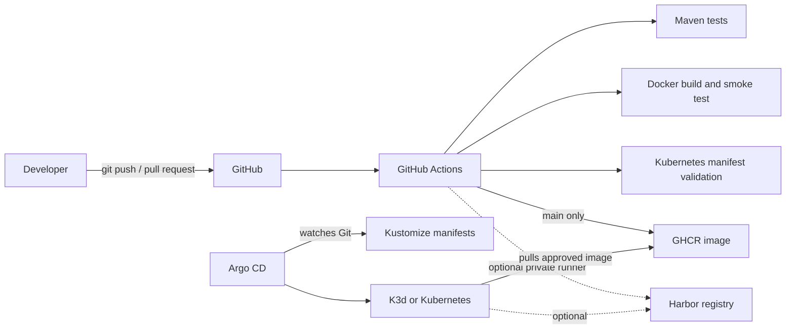

# Spring Boot GitOps Delivery Lab

[](https://github.com/natnaela-devops/springboot-ci-cd-demo/actions/workflows/validate.yml)

A reproducible local lab for building, testing, containerizing, validating, and promoting a Spring Boot service with GitHub Actions, Docker, Kubernetes/K3d, GHCR or Harbor, and Argo CD.

This repository demonstrates a delivery pattern; it does not claim that the lab itself runs in production. The application, addresses, credentials, and manifests are safe examples and must be adapted before use in a real environment.

## What is proven automatically

Every pull request runs the following gates:

- Maven tests and package verification
- Dockerfile linting
- Multi-stage container build
- Container startup and `/actuator/health` smoke test
- Kustomize rendering and Kubernetes client-side validation

Pushes to `main` additionally publish immutable commit-SHA and `latest` image tags to GitHub Container Registry using the repository-scoped `GITHUB_TOKEN`. Harbor remains an optional target for local or private-network practice.

## Architecture



## Repository layout

```text
.
├── .github/workflows/validate.yml
├── argocd/application.yaml
├── docs/harbor.md
├── k8s/
│   ├── deployment.yaml
│   ├── kustomization.yaml
│   ├── namespace.yaml
│   ├── networkpolicy.yaml
│   ├── pdb.yaml
│   └── service.yaml
├── src/
├── Dockerfile
├── Makefile
└── pom.xml
```

## Run locally

Requirements: Java 17, Docker, and kubectl. K3d and Argo CD are optional for the full GitOps exercise.

```bash
./mvnw verify
docker build --tag springboot-gitops-demo:local .
docker run --rm --publish 8080:8080 springboot-gitops-demo:local
```

In another terminal:

```bash
curl --fail http://localhost:8080/actuator/health
curl --fail http://localhost:8080/api/message
```

## Validate the Kubernetes manifests

```bash
kubectl kustomize k8s
kubectl apply --dry-run=client --validate=false --filename <(kubectl kustomize k8s)
```

The base manifests include:

- two replicas and a rolling-update strategy
- readiness, liveness, and startup probes
- CPU and memory requests/limits
- non-root execution, dropped Linux capabilities, and a read-only root filesystem
- a PodDisruptionBudget and a default-deny-oriented NetworkPolicy
- a ClusterIP service rather than a fixed NodePort

## Deploy to K3d

Create a local cluster and import the image:

```bash
k3d cluster create gitops-lab --agents 1
k3d image import springboot-gitops-demo:local --cluster gitops-lab
```

For a fully local run, update the image in `k8s/kustomization.yaml` to `springboot-gitops-demo:local`, then apply and verify:

```bash
kubectl apply --filename <(kubectl kustomize k8s)
kubectl rollout status deployment/springboot-app --namespace portfolio-demo --timeout=120s
kubectl port-forward service/springboot-app 8080:80 --namespace portfolio-demo
```

## GitOps promotion model

The workflow publishes an image; it does not silently edit deployment manifests. Promotion is an explicit, reviewable Git change:

1. Select a successful immutable image tag.
2. Update `newTag` in `k8s/kustomization.yaml`.
3. Open a pull request and pass all validation gates.
4. Merge the manifest change.
5. Argo CD detects the Git change and synchronizes it.

The example Argo CD Application is in `argocd/application.yaml`. Review its repository URL, revision, destination, and sync policy before applying it.

## Harbor option

Use [the Harbor integration guide](docs/harbor.md) when practicing with a private registry. A cloud-hosted runner cannot reach a private Harbor instance unless secure network connectivity or a self-hosted runner is deliberately configured. The repository therefore does not advertise a public ngrok tunnel as a production pattern.

## Evidence boundaries

- CI proves source tests, image construction, local container health, and static manifest validity.
- The Argo CD object demonstrates declarative configuration but does not prove a live cluster sync by itself.
- Production readiness would additionally require signed images, secret management, TLS, policy enforcement, vulnerability management, registry retention, rollback exercises, and environment-specific capacity testing.

## License

MIT
